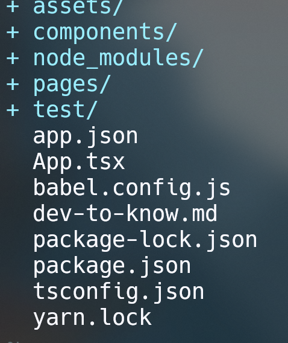

# Hnote 开发文档

## 开发工具

### 使用语言
JavaScript， TypeScript
### 使用框架
前端： React-Native | React | Expo

后端： nodejs

数据库：mongodb

## 项目规划

### 界面设计
界面设计由mjy完成，链接：https://modao.cc/app/WlS9sj1jr6rh1w72R6rdZJ#screen=skz7v5oyx95b9i4

### 组件交互
待补充

### 后端api
待补充

## 项目结构

assets:存放静态资源文件，如图标等

components: 存放组件代码文件，格式为.tsx(for typescript) 和.js

pages: 存放Screens，格式为js

app.json: app配置文件，一般不作修改

App.tsx: 项目入口

tsconfig.json: typescript配置文件，不动

package.json: npm包配置文件， 一般不动

其中node_modules, package-lock.json, yarn.lock 为npm包配置文件，不作修改，忽略即可

## 代码规范
采用vm(view-model)设计模式。

**缩进** ： 采用2空格缩进

**注释** ： 组件头部添加注释，对组件功能、函数功能及其参数简要注释

**命名规则** : 函数、变量使用驼峰式命名（如fooBar），组件名使用Pascal命名（如FooBar） 
